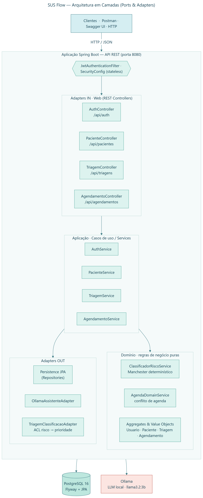
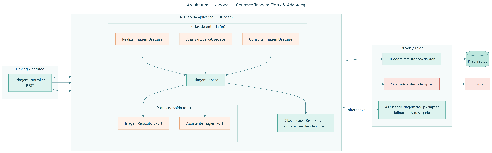
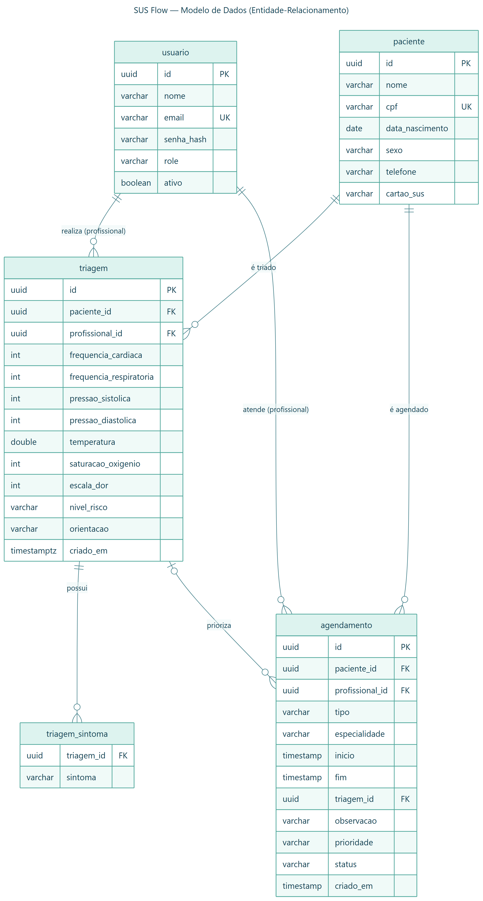
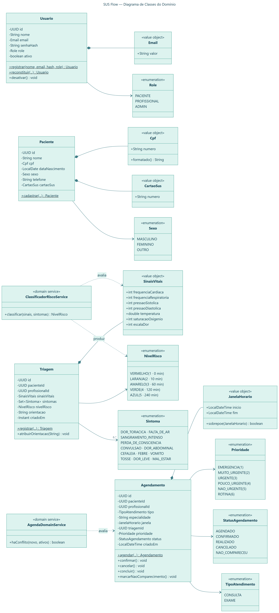
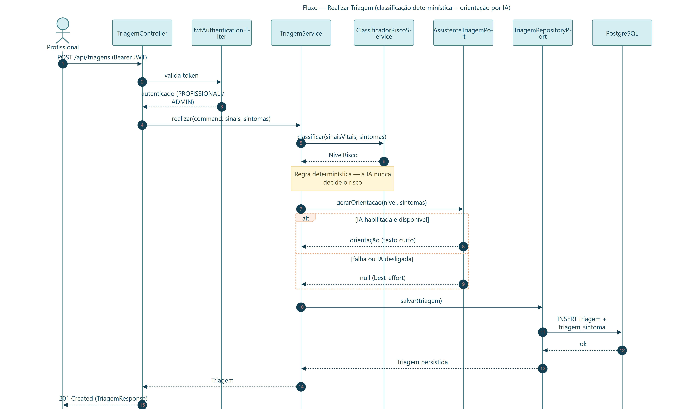
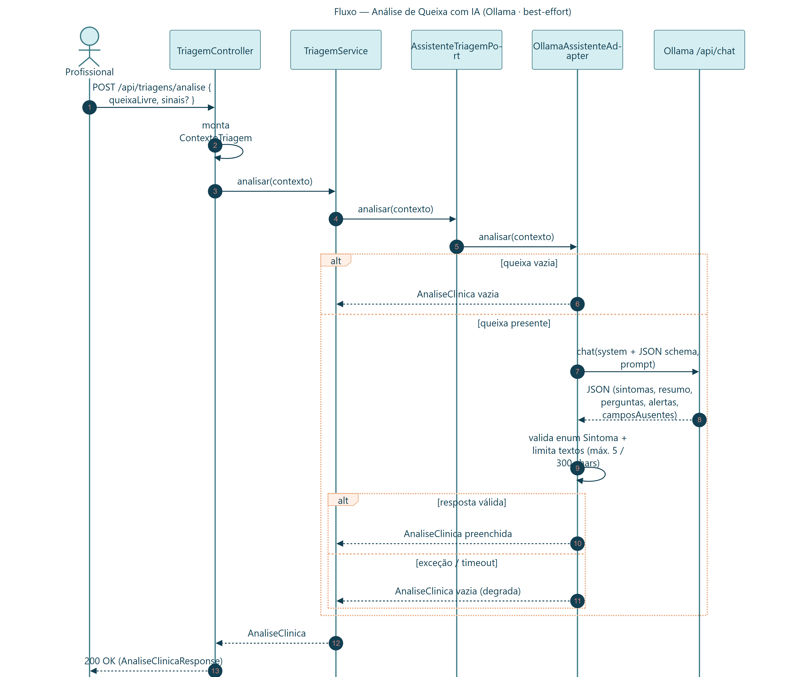
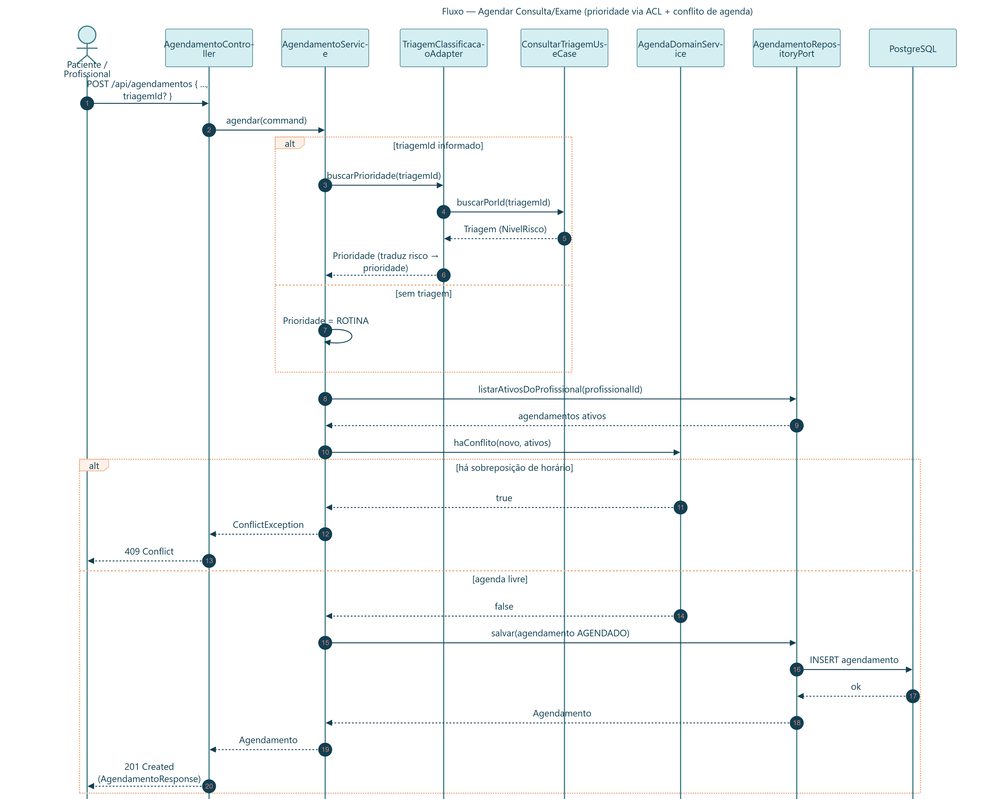
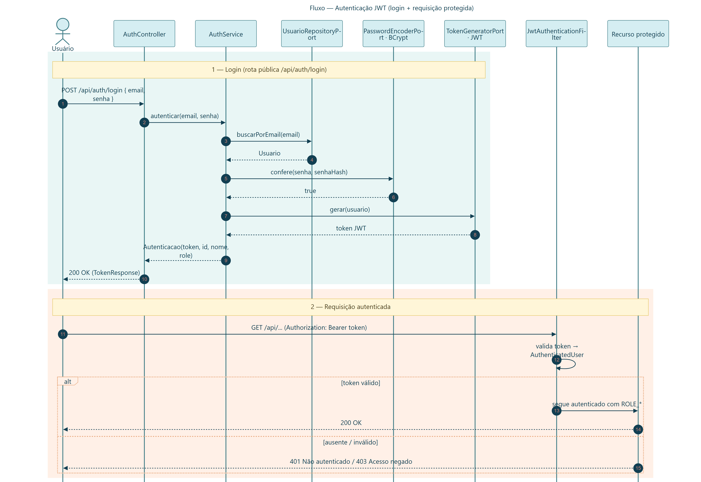
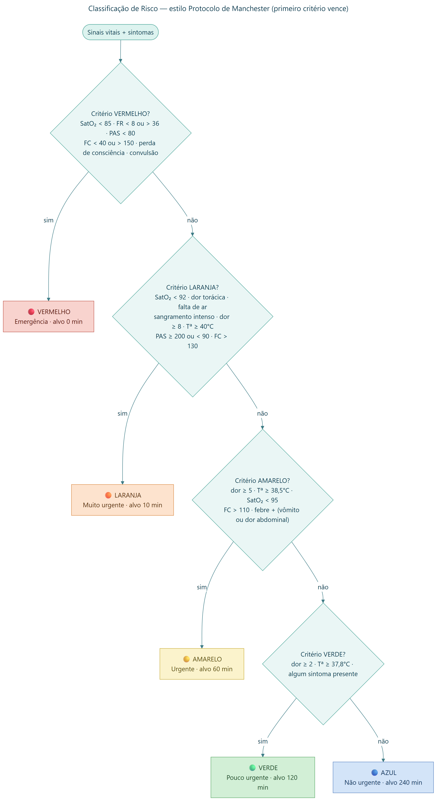

# SUS Flow — Triagem inteligente e agendamento prioritário

MVP back-end para apoiar o acolhimento no SUS. O sistema permite cadastrar pacientes, analisar queixas com IA local, realizar uma classificação de risco determinística e agendar atendimentos conforme a prioridade resultante.

> **Importante:** a IA é assistiva. Ela sugere sintomas, perguntas e alertas para revisão profissional; não diagnostica, não prescreve e não decide o nível de risco.

## Funcionalidades

- Autenticação JWT com os perfis `PACIENTE`, `PROFISSIONAL` e `ADMIN`.
- Cadastro e consulta de pacientes.
- Análise de queixa livre via Ollama, com sintomas sugeridos, perguntas complementares, alertas e campos ausentes.
- Classificação de risco determinística baseada em sinais vitais e sintomas.
- Orientação ao paciente gerada em modo best-effort após a classificação.
- Agendamento de consultas/exames com prioridade derivada da triagem.
- Documentação OpenAPI/Swagger, health check, migrations Flyway e collection Postman.

## Arquitetura e relatório

- [Relatório do projeto](docs/Projeto_SUS_Flow_Relatorio.pdf)
- [Diagramas técnicos (catálogo completo)](docs/diagramas/)
- [Collection Postman](postman/Atendimento-SUS.postman_collection.json)

## Diagramas técnicos

Diagramas gerados a partir do código-fonte. Os fontes Mermaid, o tema e o script de regeneração ficam em [`docs/diagramas/`](docs/diagramas/).

### Visão de arquitetura

**Arquitetura em camadas (Ports & Adapters)** — camadas do sistema: clientes → filtro JWT → controllers (adapters de entrada) → casos de uso/serviços → domínio puro, com adapters de saída para PostgreSQL e Ollama.



**Arquitetura hexagonal — contexto Triagem** — detalhe de um contexto: portas de entrada (use cases) e de saída (repositório e assistente de IA) com seus adapters, incluindo o fallback `NoOp` quando a IA está desligada.




### Dados e domínio

**Modelo de dados (ER)** — esquema do banco (migrations Flyway): `usuario`, `paciente`, `triagem`, `triagem_sintoma` e `agendamento`, com chaves e relacionamentos.



**Classes do domínio** — agregados, value objects e enums dos quatro contextos, além dos serviços de domínio (`ClassificadorRiscoService`, `AgendaDomainService`).



### Fluxos (diagramas de sequência)

**Realizar triagem** — o risco é decidido pelo classificador determinístico; a orientação por IA é *best-effort* e degrada para nulo em caso de falha.



**Análise de queixa com IA (Ollama)** — extração de sintomas e sugestões a partir de texto livre, com degradação graciosa em erro ou timeout.



**Agendar consulta/exame** — prioridade derivada da triagem via ACL e verificação de conflito de agenda antes de persistir.



**Autenticação JWT** — login (rota pública) e requisição autenticada passando pelo filtro stateless.




**Classificação de risco (estilo Protocolo de Manchester)** — árvore de decisão com os limiares reais do código; o primeiro critério satisfeito vence (VERMELHO → AZUL).




## Pré-requisitos

- Docker Engine e Docker Compose Plugin.
- Para execução sem Docker: Java 21, PostgreSQL 16 e uma instância Ollama com o modelo configurado.

## Execução rápida com Docker

Na raiz do repositório, execute:

```bash
docker compose up --build
```

O Compose sobe automaticamente:

| Serviço | Endereço | Finalidade |
|---|---|---|
| API | `http://localhost:8080` | Aplicação Spring Boot |
| PostgreSQL | `localhost:5432` | Banco de dados |
| Ollama | `http://localhost:11434` | IA local |

Na primeira execução, o serviço `ollama-pull` baixa o modelo `llama3.2:3b`; isso pode levar alguns minutos.

### Verificar a saúde da API

```bash
curl http://localhost:8080/actuator/health
```

Resposta esperada:

```json
{"status":"UP"}
```

## Documentação e demonstração

| Recurso | URL/arquivo |
|---|---|
| Swagger UI | `http://localhost:8080/swagger-ui.html` |
| OpenAPI JSON | `http://localhost:8080/v3/api-docs` |
| Health check | `http://localhost:8080/actuator/health` |
| Postman | Importe `postman/Atendimento-SUS.postman_collection.json` |

### Ordem sugerida no Postman

1. **Registrar profissional**.
2. **Login - Profissional** — o script salva `token` e `profissionalId` nas variáveis da collection.
3. **Cadastrar paciente** — o script salva `pacienteId`.
4. **Analisar queixa com IA** — use o exemplo mínimo ou o exemplo com contexto completo.
5. **Realizar triagem** — o script salva `triagemId`.
6. **Agendar consulta** — o script salva `agendamentoId`.

## Análise de queixa com IA

Endpoint protegido para `PROFISSIONAL` e `ADMIN`:

```http
POST /api/triagens/analise
Authorization: Bearer <token>
Content-Type: application/json
```

Request mínimo, compatível com o fluxo inicial:

```json
{
  "queixaLivre": "Estou com febre e tosse há três dias."
}
```

Request enriquecido, que oferece contexto ao assistente:

```json
{
  "queixaLivre": "Dor no peito há duas horas, com falta de ar.",
  "sintomasSelecionados": ["DOR_TORACICA", "FALTA_DE_AR"],
  "frequenciaCardiaca": 112,
  "frequenciaRespiratoria": 24,
  "pressaoSistolica": 145,
  "pressaoDiastolica": 90,
  "temperatura": 37.2,
  "saturacaoOxigenio": 93,
  "escalaDor": 8
}
```

Quando informados, os sinais vitais devem ser enviados integralmente. A resposta contém `sintomasSugeridos`, `resumo`, `perguntasComplementares`, `alertasParaConferencia` e `camposAusentes`.

## Configuração

| Variável | Padrão | Descrição |
|---|---|---|
| `DB_HOST` | `localhost` | Host PostgreSQL |
| `DB_PORT` | `5432` | Porta PostgreSQL |
| `DB_NAME` | `atendimento_sus` | Banco de dados |
| `DB_USER` / `DB_PASSWORD` | `postgres` | Credenciais do banco |
| `JWT_SECRET` | valor de desenvolvimento | Segredo JWT; troque em produção |
| `APP_AI_ENABLED` | `true` | Habilita Ollama; use `false` para fallback sem IA |
| `OLLAMA_BASE_URL` | `http://localhost:11434` | URL do Ollama |
| `OLLAMA_MODEL` | `llama3.2:3b` | Modelo utilizado |
| `OLLAMA_TIMEOUT_SECONDS` | `60` | Timeout das chamadas IA |

## Testes

```bash
./mvnw test
```

Os testes de integração usam Testcontainers e podem exigir Docker disponível. Caso o wrapper não tenha permissão de execução, use:

```bash
bash ./mvnw test
```

## Limitações do MVP

- As regras são uma implementação **no estilo** do protocolo de Manchester; não representam certificação clínica oficial.
- O projeto não substitui avaliação médica ou de enfermagem.
- Uma evolução produtiva deve incluir autorização por recurso/unidade, auditoria de IA, observabilidade e validação clínica formal.

